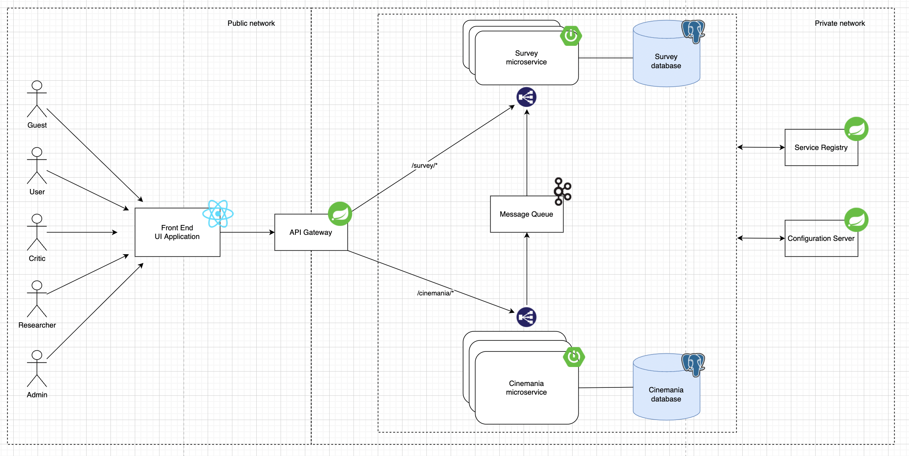
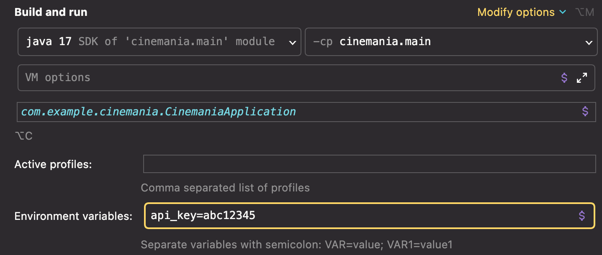

# 🎥 Cinemania 📽

## About project

Cinemania is IMDb like movie/tv shows platform that allows you to rate, review and check as watched pictures you watched. It contains some features like recommending other pictures based on what you've already seen. This part of the project is mostly based on external API from [TMDB](https://www.themoviedb.org/?language=pl). Beside that, the project has "survey part". That means, application stores user data, ratings and optional survey answers and based on them generates data in form of CSV that can be later processed by hypothetical researchers.

## Architecture



## Local Development

In order to run application, you have to have PostgreSQL Databases running locally.
Here is the command you can use to run a Docker container with empty databases.
```shell
docker run -d \
    --name cm-pictures-db \
    -p 5433:5432 \
    -e POSTGRES_USER=postgres \
    -e POSTGRES_DB=pictures \
    -e POSTGRES_PASSWORD=password \
    postgres:alpine
    
docker run -d \
    --name cm-surveys-db \
    -p 5434:5432 \
    -e POSTGRES_USER=postgres \
    -e POSTGRES_DB=surveys \
    -e POSTGRES_PASSWORD=password \
    postgres:alpine

# same commands in one line
docker run -d --name cm-pictures-db -p 5433:5432 -e POSTGRES_USER=postgres -e POSTGRES_DB=pictures -e POSTGRES_PASSWORD=password postgres:alpine
docker run -d --name cm-surveys-db -p 5434:5432 -e POSTGRES_USER=postgres -e POSTGRES_DB=surveys -e POSTGRES_PASSWORD=password postgres:alpine

```

Here is the command you can use to get inside Postgres from command line(use password 'password' when prompted):
```shell
docker exec -it cm-pictures-db psql -U postgres -W postgres
docker exec -it cm-surveys-db psql -U postgres -W postgres
```

While running cinemania microservice, you also need to set environment variable `api_key` to you TMDB key. For example:

